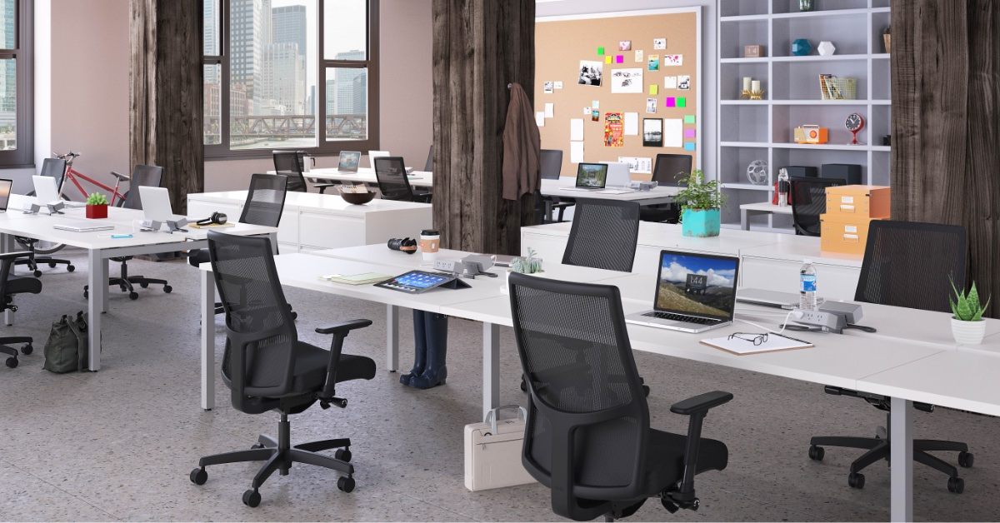
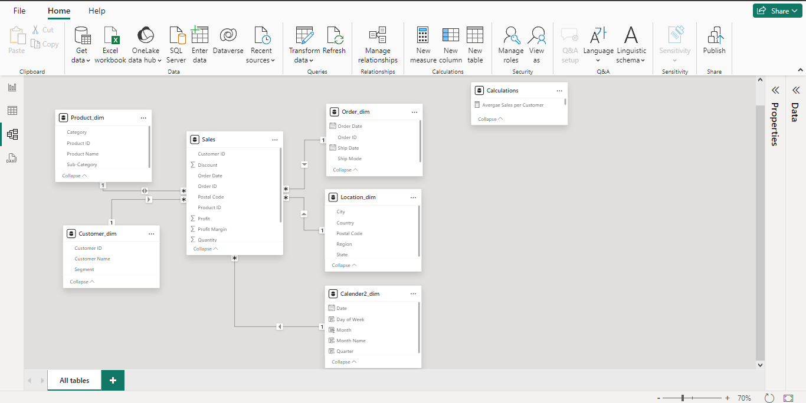
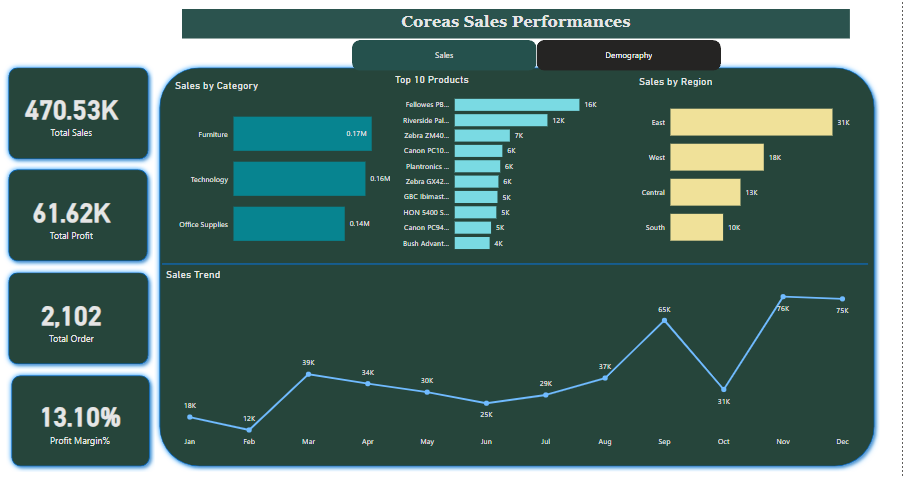

# Coreas Sales Analysis

---

## Introduction

This is a power BI project on sales analysis of an imaginary store called **Coreas Stores Analysis**. 
The project is to analyze and derive Insights to answer crucial questions and help the store make data decisions.

_**Disclaimer**_: _All datasets and reports do not represent any company, institution or country, but just a dummy dataset to demonstrate capabilities of power BI._

## Problem Statement:
1.	Identify the patterns and trends in sales transactions among the product categories
2.	Optimize sales performance and profitability in the different regions across the country
3.	What is the most preferable mode of shipments?

## Skills/ concepts demonstrated:
- Bookmarkings,
-  DAX,
-  Page navigation,
-  Modelling

### Callender table:

Created a calendar table with month, number and year to analyse sales in different months

 ## Modelling:
 Automatically derived relationships are adjusted to remove and replace unwanted relationships with the required.

The model is a star schema
There are 5-dimension tables and 1 fact table. The dimension tables are all joined to the fact table with one-to-many relationship.

## Visualization
The report comprises 2 major pages
1.	Coreas sales performance
2.	Demography performance

you can interact with the report [here](https://app.powerbi.com/groups/me/reports/4dfa8df7-c7c0-407d-8add-0e005665f3df/ReportSection46e6db90e580d907e480?experience=power-bi)

Features:
The sales is button to display the sales performance while the performance button display the demagraphy performance 

## Analysis:
### Sales performance: 

The total sales is $470.53k
2102 orders were made in that current year
Profit Margin is 13.10%

### Monthly sales
The month of November has the highest sales of $75,972.😄

### Sales by region
The sales by region include east, west, central and south

### Demography performance:

Total customers are 573
Quantity sold that year were 7979
Profits by segment include corporate , consumer and then home office
Top 5 states by profit include New york , California, Washington, Michigan and Georgia
Standard class is the most prefered ship mode

## Conclusion 
- Furnitures has the highest sales 
- There are 3 main segments in the stores with various segments
- The east part of the country record the highest sales
 
## Recommendations
- Products should be sold more to the east and west of the country
- More Incentives should be created to improve more sales generally across the country
- The quantity in stock of products with low sales performance should be reduced to provide capital for hot selling products & enable cash flow for business.
- Also, the top performing products as visualized in the subcategory should be stocked more since they were mostly purchased.

  
  

 

